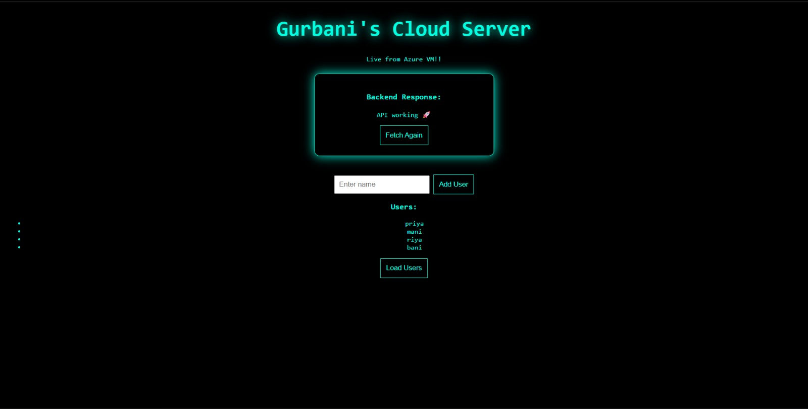

# 🚀 Azure Cloud User App

A full-stack cloud application deployed on an Azure Virtual Machine.

---

## 🧩 Tech Stack

- HTML, CSS, JavaScript
- Node.js, Express
- MongoDB (Docker)
- Nginx
- Azure VM

---

## ⚙️ Features

- Add users via API
- Fetch users dynamically
- Persistent storage
- Reverse proxy setup
- Cloud deployment

---

## 🏗️ Architecture

Frontend → Backend API → Database

---

## 📸 Demo



---

## 🚀 Run Locally

```bash
cd backend
npm install
node server.js
```

---

## 🌐 Deployment

Hosted on Azure Virtual Machine

---

## 👤 Credits

Built by **Gurbani Gambhir (2026)**
